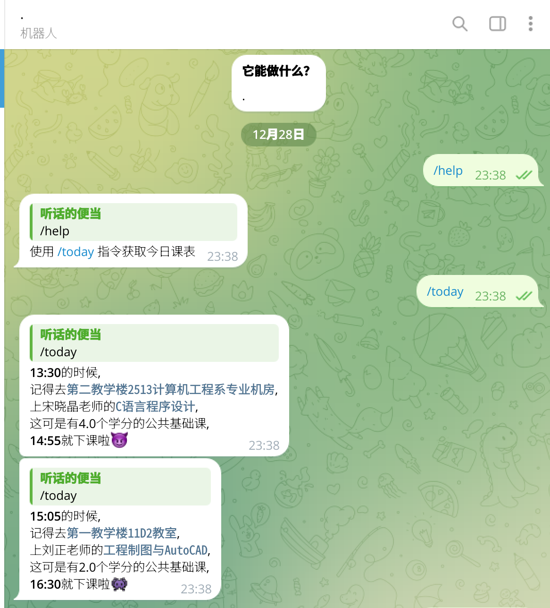

# zhic_tgbot

一个获取天津理工大学中环信息学院当天课表的tgbot

## 使用方法

需要一个有python3环境的终端.

输入:

```sh
pip install pyTelegramBotAPI
```

安装相关依赖.

输入:

```sh
python3 app.py
```

## 截图



## 当前缺陷

* 登陆不方便, 需要自己从官网获取cookies, 添加到`my_class.py`.
* 没法获取指定日期的课程情况.