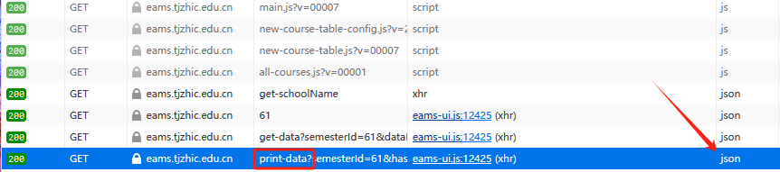
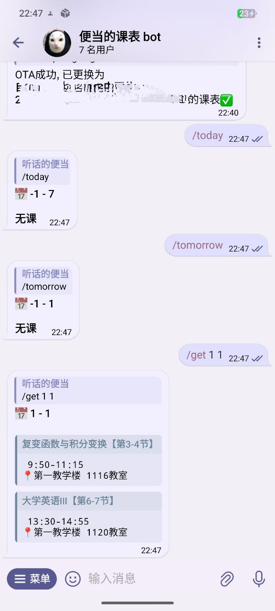
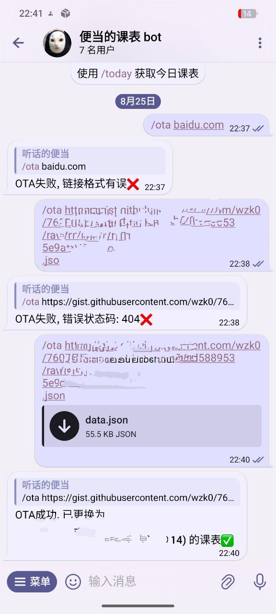

# zhic_tgbot

一个获取天津理工大学中环信息学院课表的tgbot, 支持一种类OTA的方式远程更新课表.

## 使用方法

需要一个有python3环境的终端.

输入:

```sh
pip install pyTelegramBotAPI
```

安装相关依赖.

输入:

```sh
python3 app.py
```

修改`app.py`里的`API_TOKEN`与`ADMIN`, 以及可选的`date`(学期开始的那一天, 用于计算绝对周数和星期)

第一次运行前需到学校官网把`json文件`爬下来.



直接下载/打开链接, 复制里面所有内容粘贴到`data.json`即可.

## 指令

说明: `<>`内是必带参数, `[]`内是可选参数.

> /ota < 课表json链接 > - 更新课表文件

> /get < week > [ weekday ] - 获取指定周 [ 指定星期 ] 的课表

> /today - 获取今日课表

> /tomorrow - 获取明日课表

其他情况 - 发送文本消息会与AI进行对话(需填写`AI_KEY`), 模型用的是`gemini-1.5-pro`

## 截图






## 当前缺陷

~~* 登陆不方便, 需要自己从官网获取cookies, 添加到`my_class.py`.~~ 已换用类OTA的方式更新或切换课表.

~~* 没法获取指定日期的课程情况.~~